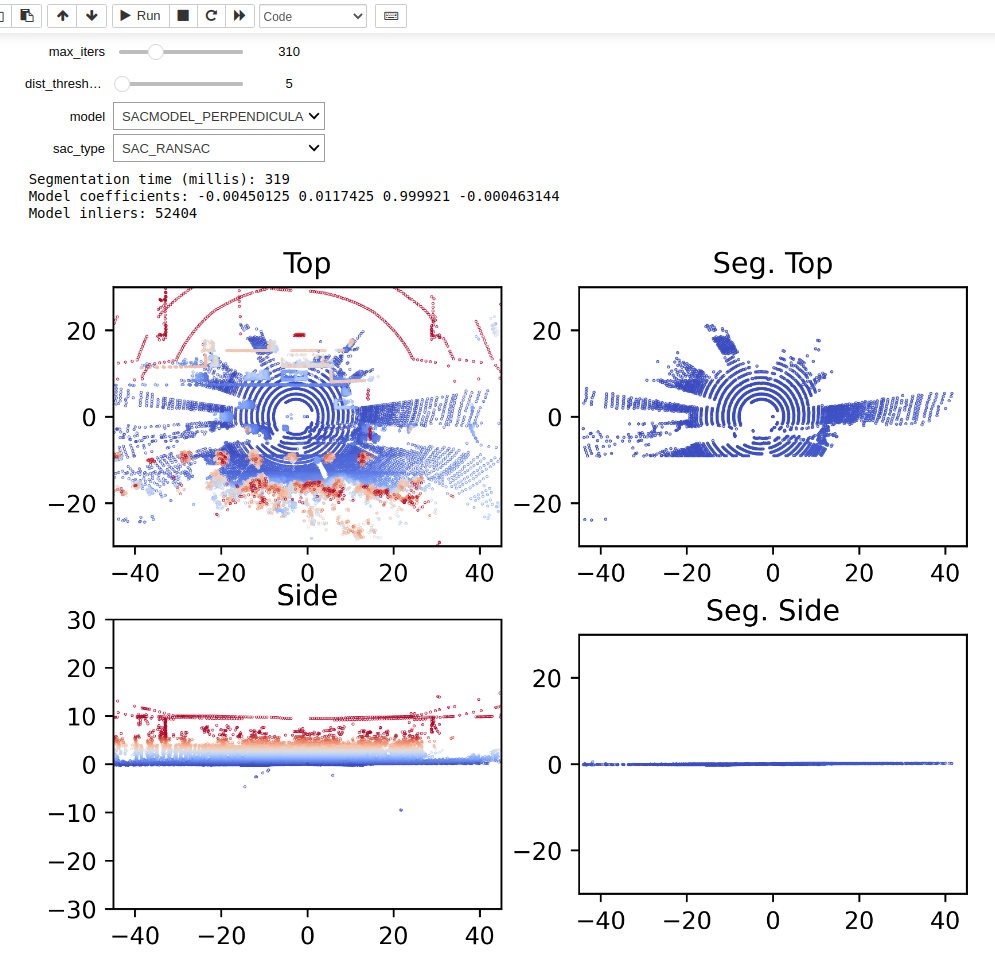

# pcl-sac-segmentation-comp

A repo for comparing PCL's SAC segmentation algorithms in an interactive Jupyter notebook.

To run the notebook, use `bazel run notebooks` and select `ground_segment_1.ipynb`. Three point cloud .pcd files are added for convenience.

The full capabilities of the PCL segmentation library is documented at https://pcl.readthedocs.io/en/latest/planar_segmentation.html. A few of the parameters are exposed as interactive sliders. It is easy to add parameters depending on interest.
